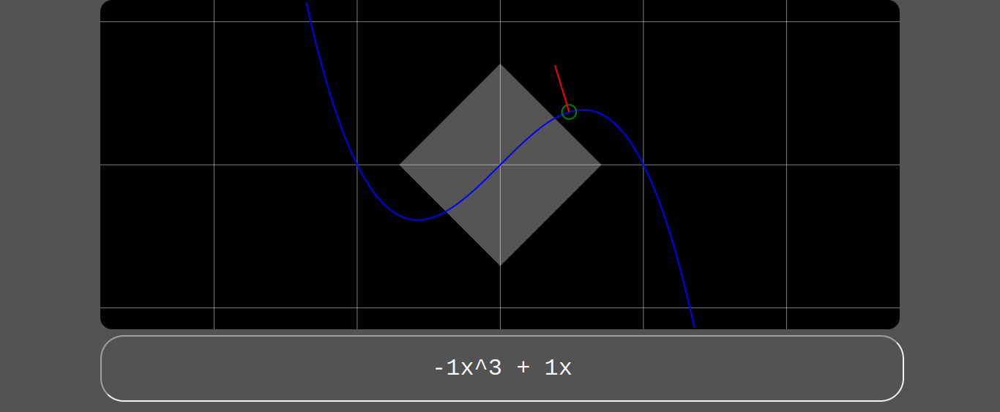

# Graphing a quadratic function

I've been studying for my ASVAB and decided to make a quadratic function parser.

Create a parabola with a function string like:
`3x^2 - 11x - 4`
```javascript
let p0 = new Parabola("3x^2 - 11x - 4");
console.log(
    p0.getY(2); //Get the corresponding Y coord for the given X coord
);
```

There is a built in canvas rendering function that will render
the parabola given a context
`p0.render(canvasContext2d)`

[See example code](https://github.com/RepComm/quadgraph/blob/master/index.html)


[Live Demo](https://repcomm.github.io/quadgraph)


